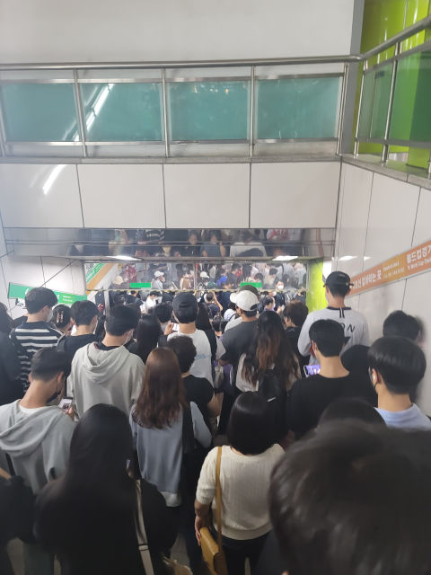

# 서울월드컵경기장 iCal

## why?

평화로운 퇴근을 위하여.



> 실시간...축구보러가는길 합정역
>
> 열차 최소 3번은 놓칠듯 ㅠ
>
> <https://bbs.ruliweb.com/etcs/board/300781/read/57392774>

## URL

- iCal
  - <https://raw.githubusercontent.com/if1live/sangam-stadium-ical/refs/heads/main/docs/calendar.ics>
- JSON
  - <https://github.com/if1live/sangam-stadium-ical/blob/main/docs/schedule.json>


## usage

```sh
# html -> schedule.json
pnpm tsx src/main.ts crawl

# schedule.json -> sangam-stadium.ics
pnpm tsx src/main.ts write
```

## 데이터 출처

서울시설공단 - 서울월드컵경기장 - 시설이용안내 - 경기/행사 일정
... 을 적당히 크롤링

<https://www.sisul.or.kr/open_content/sub/schedule/list.do?year=2025&month=7&site_div=worldcupst>

## TODO

- [ ] 적당한 주기로 크롤링 자동화
- [ ] 하드코딩한 2025년 어쩌지
- [ ] github pages로 하면 왜 google calendar에서 못알아먹을까? raw file만 되나?

